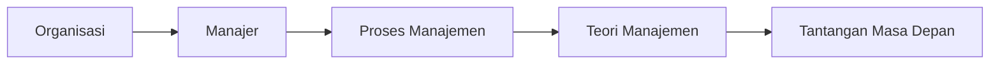
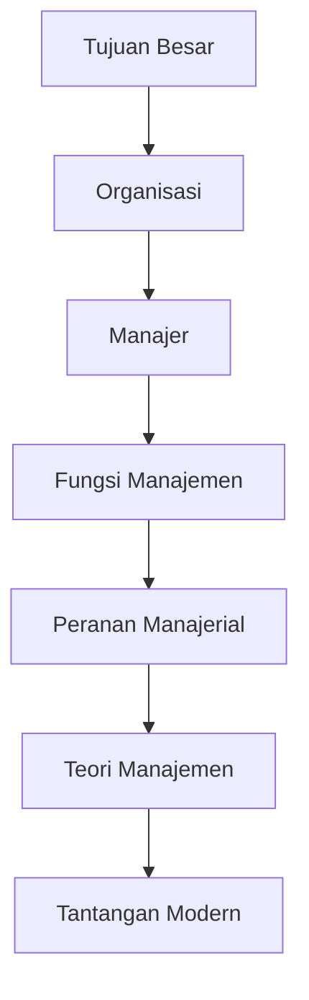
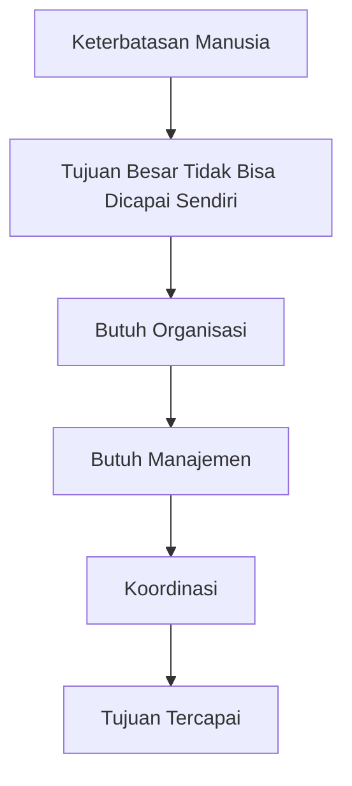

# 📒 Modul 01 — Pengantar Manajemen

> *“Manajemen adalah seni menyelesaikan pekerjaan melalui orang lain secara efektif dan efisien.”*


---

# 📝 Tujuan Pembelajaran

Setelah mempelajari modul ini, kita diharapkan mampu memahami:

✅ **Definisi & esensi** organisasi, manajer, dan manajemen  
✅ **Proses manajemen** (*Planning, Organizing, Leading, Controlling*)  
✅ **Peran & keterampilan manajer** di berbagai level organisasi  
✅ **Perkembangan teori manajemen** dari klasik → modern  
✅ **Tantangan masa depan manajemen** (globalisasi, etika, profesionalisme)

---

# 📝 Gambaran Besar Modul

## 🩷 Modul ini membahas apa?

Modul ini adalah **pondasi utama ilmu manajemen**.

Kita akan belajar:



Mulai dari:

- Apa itu **organisasi**
- Siapa itu **manajer**
- Apa yang dilakukan manajer
- Bagaimana teori manajemen berkembang
- Tantangan manajemen di era modern

---

## 🩷 Kenapa materi ini penting?

Tanpa manajemen:

❌ Perusahaan besar tidak berjalan  
❌ Organisasi kacau  
❌ Sumber daya terbuang

Misalnya perusahaan seperti **Coca-Cola** atau **Boeing**:

Mereka mengelola:

- Ribuan pekerja
- Jutaan komponen
- Operasi lintas negara

Tanpa manajemen yang baik → organisasi akan gagal.

---

## 🩷 Hubungan Antar Topik

Materi ini memiliki urutan logika seperti berikut:

```text
Tujuan besar manusia
        ↓
Membentuk organisasi
        ↓
Butuh manajer
        ↓
Manajer menjalankan fungsi manajemen
        ↓
Muncul teori manajemen
        ↓
Adaptasi terhadap tantangan modern
```

---

# 📝 Konsep Inti

---

# 1. Organisasi

## 🩷 Definisi

> Organisasi adalah sekumpulan orang yang bekerja sama secara terkoordinasi untuk mencapai tujuan tertentu.

---

## 🩷 Inti Konsep

Agar disebut **organisasi**, harus ada:

| Unsur | Penjelasan |
|--------|-------------|
| 👥 Orang | Minimal ada individu yang terlibat |
| 🤝 Koordinasi | Ada pembagian tugas |
| 🎯 Tujuan | Memiliki sasaran bersama |

Tanpa salah satu unsur tersebut → **bukan organisasi**.

---

## 🩷 Kenapa Penting?

Organisasi membuat tujuan besar dapat dicapai dengan:

- Lebih **efektif**
- Lebih **efisien**
- Lebih **terstruktur**

Organisasi juga menjaga ilmu & budaya agar diwariskan lintas generasi.

---

## 🩷 Hubungan dengan Konsep Lain

**Manajer bekerja di dalam organisasi.**

Tanpa organisasi:

> Tidak ada sesuatu yang perlu dikelola.

---

## 🩷 Contoh Sederhana

### ✅ Organisasi
Koperasi pensiunan yang dibentuk untuk mencari keuntungan bersama.

### ❌ Bukan Organisasi
Kerumunan demonstran yang sudah kehilangan koordinasi dan tujuan.

---

## 🩷 Kesalahan Umum

> **Mitos:** Banyak orang = organisasi

**Salah.**

Harus ada:

✔️ koordinasi  
✔️ tujuan bersama

Kalau tidak → hanya **kerumunan**.

---

# 2. Efektivitas vs Efisiensi

## 🩷 Definisi

| Konsep | Makna |
|--------|--------|
| **Efisiensi** | *Doing things right* |
| **Efektivitas** | *Doing the right things* |

---

## 🩷 Penjelasan Konsep

### Efisiensi
Fokus pada:

> **bagaimana cara bekerja**

Target:

- hemat biaya
- hemat waktu
- hemat tenaga

Rumus sederhananya:

```text
Efisiensi = Output / Input
```

---

### Efektivitas
Fokus pada:

> **apakah tujuan tercapai**

Organisasi bisa efisien tapi tidak efektif.

---

## 🩷 Contoh Sederhana

### Kasus Pabrik Mesin Ketik

✅ Produksi murah  
✅ Hemat bahan

Tapi:

❌ Tidak laku di pasar

Karena orang sudah memakai komputer.

**Kesimpulan:**

Efisien ❌  
Efektif ❌

---

## 🩷 Kenapa Penting?

Manajer dinilai dari:

```text
Efektif + Efisien
```

Urutannya:

> **Benar dulu → Baru hemat**

**Pilih produk yang benar dulu (efektif)**  
Baru cari cara termurah membuatnya (efisien)

---

## 🩷 Penting!

**Sering tertukar!**

### Ingat shortcut:

🟢 **Efektif = tujuan**

🔵 **Efisien = cara**

---

# 3. Fungsi Manajemen

## 🩷 Definisi

Manajemen memiliki **4 fungsi utama**:

```text
Planning
↓
Organizing
↓
Leading
↓
Controlling
```

Disebut juga **POLC**.

---

## 1️⃣ Planning (Perencanaan)

Menentukan:

- tujuan
- strategi
- cara mencapai target

### Contoh
Menentukan target penjualan restoran.

---

## 2️⃣ Organizing (Pengorganisasian)

Mengatur:

- struktur kerja
- pembagian tugas
- penempatan SDM

### Contoh
Membagi tugas kasir dan koki.

---

## 3️⃣ Leading (Pengarahan)

Memotivasi orang agar bekerja optimal.

### Contoh
Memberi semangat saat restoran ramai.

---

## 4️⃣ Controlling (Pengendalian)

Memastikan hasil sesuai rencana.

### Contoh
Mengecek laporan keuangan.

---

## 🩷 Kesalahan Umum

Mahasiswa sering mengira:

```text
Planning
→ selesai
Organizing
→ selesai
Leading
→ selesai
Controlling
→ selesai
```

Padahal kenyataannya:

> Semua fungsi berjalan **bersamaan**.

Manajer bisa mengontrol sambil mengarahkan tim.

---

# 4. Peranan Manajerial (Henry Mintzberg)

Manajer memiliki **10 peran** yang dibagi menjadi:

| Kategori | Peran |
|----------|-------|
| 🤝 Interpersonal | Figurehead, Leader, Liaison |
| 📢 Informasional | Monitor, Disseminator, Spokesperson |
| 🧩 Pengambilan Keputusan | Entrepreneur, Disturbance Handler, Resource Allocator, Negotiator |

---

## 🩷 Contoh Praktis

| Situasi | Peran |
|---------|------|
| Membuka cabang baru | Figurehead |
| Menyelesaikan konflik karyawan | Disturbance Handler |
| Menyampaikan informasi ke tim | Disseminator |
| Negosiasi vendor | Negotiator |

---

# 📝 Alur Berpikir Modul



---

# 📝 Poin Penting

## 🩷 Wajib Hafal

| Topik | Hal Penting |
|-------|-------------|
| Efektif vs Efisien | Jangan tertukar |
| Skill Manajer | Top = konseptual |
| Taylor | Produktivitas |
| Fayol | 14 prinsip |
| Hawthorne | Diperhatikan → produktif |
| Sistem | Input → proses → output |

---

# 📝 Ringkasan 

```text
MANAJEMEN
= mencapai tujuan
secara efektif & efisien
melalui orang lain

4 Fungsi:
P = Planning
O = Organizing
L = Leading
C = Controlling

Top Management → Conceptual Skill
Middle → Human Skill
Lower → Technical Skill

Taylor → Scientific Management
Fayol → Administrative Theory
Mayo → Hawthorne Effect
Weber → Bureaucracy
```

---

# 📝 Kata Kunci 

| Istilah | Makna |
|---------|------|
| Soldiering | Sengaja memperlambat kerja |
| Entropi | Sistem menuju kehancuran |
| Sinergi | 2 + 2 = 5 |
| Differential Rate | Upah berdasarkan output |
| Birokrasi | Struktur formal Weber |

---

# 📝 Pertanyaan Pemahaman Diri

1. Mengapa manajemen disebut ilmu dan seni?  
2. Apa beda organisasi profit & non-profit?  
3. Jelaskan hubungan input–proses–output di universitas!  
4. Mengapa supervisor lebih butuh technical skill?  
5. Sebutkan 3 peran informasional Mintzberg!  
6. Mengapa visi penting di era globalisasi?  
7. Apa kontribusi Adam Smith?  
8. Sebutkan 4 prinsip Taylor!  
9. Apa itu kesatuan komando Fayol?  
10. Apa itu *Zone of Acceptance* menurut Barnard?

---

## 🩷 Last Minute Review 

> **Efektif = tujuan benar**  
> **Efisien = cara hemat**  
> **POLC = Planning–Organizing–Leading–Controlling**  
> **Mintzberg = Interpersonal + Informasi + Keputusan**  
> **Taylor = Efisiensi kerja**  
> **Mayo = Faktor sosial manusia**  
> **Sistem = Input → Proses → Output**


---

# 📝 Cara Berpikir   
## *“Dari Kekacauan Menuju Keteraturan”*

> **Jangan melihat manajemen sebagai sekadar mata kuliah.**  
> Lihatlah sebagai **solusi atas keterbatasan manusia**.

---

## 🩷 Big Picture: Kenapa Manajemen Itu Ada?

Manusia memiliki keterbatasan:

- ⏳ **Waktu terbatas**
- 💪 **Tenaga terbatas**
- 🧠 **Kemampuan berpikir terbatas**

Padahal, ada tujuan besar yang **mustahil dicapai sendirian**.

### Contoh Nyata

Bayangkan membangun pesawat **Boeing 747**.

```text
1 Pesawat Boeing 747
≈ 6 juta onderdil
≈ ribuan pekerja
≈ lintas divisi
≈ lintas negara
```

Mustahil dikerjakan satu orang.

Maka manusia membutuhkan:

| Kebutuhan | Fungsi |
|------------|---------|
| 🏢 **Organisasi** | Sebagai *wadah kerja sama* |
| ⚙️ **Manajemen** | Sebagai *aturan bermain* |

Tujuannya sederhana:

> Ribuan orang **tidak saling tabrak**, tetapi **saling mendukung** mencapai tujuan bersama.

---

## 🩷 Logika Besar Modul



---

# 1️⃣ Organisasi — Mengapa Harus Ada Wadah?

## 🩷 Analogi Pasar

Bayangkan ada sekumpulan orang di pasar.

### Kondisi 1 — Kerumunan

```text
Semua berteriak
Tidak ada aturan
Tidak ada tujuan bersama
```

Hasil:

> ❌ **Kerumunan biasa**

---

### Kondisi 2 — Organisasi

Sekarang mereka sepakat:

✅ Membentuk koperasi  
✅ Memiliki tujuan bersama  
✅ Ada pembagian tugas  
✅ Ada aturan kerja

Hasil:

> ✅ **Inilah organisasi**

---

## 🩷 Logika Konsep

Organisasi muncul karena manusia ingin hasil yang:

- lebih besar
- lebih aman
- lebih teratur
- lebih berkelanjutan

dibanding bekerja sendirian.

### Rumus sederhananya:

```text
Tujuan besar
+
Kerja sama terkoordinasi
=
Organisasi
```

---

## 🩷 Hubungan Sebab–Akibat

Tanpa koordinasi:

```text
Banyak orang
≠
Organisasi
```

Sekumpulan orang hebat sekalipun bisa berubah menjadi **kekacauan**.

Contohnya:

> Demonstrasi yang awalnya teratur namun berubah menjadi anarkis karena hilangnya koordinasi dan tujuan bersama.

### Inti yang wajib dipahami

> **Organisasi bukan soal banyak orang.**  
> Organisasi adalah **orang + koordinasi + tujuan**.

---

# 2️⃣ Efektivitas vs Efisiensi  
## *“Si Pintar” vs “Si Hemat”*

> Ini adalah konsep yang paling sering tertukar di UAS.

Mari pahami dengan logika sederhana.

---

## 🩷 Efektivitas (*Doing the Right Things*)

### Fokus:

> **Hasil / Target**

Pertanyaannya:

> **“Apakah tujuan tercapai?”**

---

### Contoh Logika

Anda ingin membasmi nyamuk.

Lalu menggunakan:

```text
MERIAM 💣
```

Hasil:

✅ Nyamuk mati

Artinya:

> **EFEKTIF**

Karena target tercapai.

Tapi...

❌ Biaya sangat mahal  
❌ Boros sumber daya

---

## 🩷 Efisiensi (*Doing Things Right*)

### Fokus:

> **Cara / Proses**

Pertanyaannya:

> **“Bisakah hasil dicapai dengan sumber daya lebih sedikit?”**

Targetnya:

- hemat waktu
- hemat biaya
- hemat tenaga

---

## 🩷 Hubungan Sebab–Akibat dalam Bisnis

Ini bagian paling penting:

### Urutannya harus:

```text
EFEKTIF
↓
baru
↓
EFISIEN
```

Kenapa?

Karena:

> Percuma sangat hemat memproduksi barang yang tidak dibutuhkan pasar.

---

### Contoh Pabrik Mesin Ketik

Misalnya:

Sebuah pabrik berhasil:

✅ Produksi sangat murah  
✅ Hemat bahan baku  
✅ Cepat

Artinya:

> **EFISIEN**

Tapi...

```text
Tidak ada yang beli
karena semua orang pakai komputer
```

Artinya:

> ❌ **Tidak efektif**

---

## 🩷 Shortcut 

| Konsep | Fokus |
|--------|-------|
| 🎯 Efektif | **Tujuan** |
| ⚙️ Efisien | **Cara** |

### Cara cepat mengingat:

> **Benar dulu → Baru hemat**

Pilih **produk yang benar** dulu.  
Baru cari **cara termurah** membuatnya.

---

# 3️⃣ Mengapa Teori Manajemen Muncul?  
## *“Sejarah adalah Reaksi atas Masalah”*

Banyak mahasiswa bingung:

> “Kenapa harus hafal teori?”

Jawabannya:

> Karena **setiap teori muncul untuk menjawab masalah di zamannya**.

---

## 🩷 Teori Manajemen Ilmiah — Taylor

### Masalah Zaman Itu

Pabrik mulai besar.

Masalahnya:

```text
Pekerja lambat
Produktivitas rendah
Banyak "soldiering"
(sengaja memperlambat kerja)
```

---

### Logika Taylor

> Perlakukan pekerjaan secara ilmiah.

Semua diukur:

- waktu kerja
- gerakan tubuh
- pembagian tugas
- sistem upah

Tujuan:

```text
Produktivitas naik 📈
```

### Cara berpikir Taylor:

> Manusia dianggap seperti mesin kerja yang bisa dioptimalkan.

---

## 🩷 Hawthorne — Aliran Hubungan Manusiawi

### Masalah Baru

Pendekatan Taylor ternyata punya efek samping:

❌ pekerja stres  
❌ hubungan sosial buruk

---

### Eksperimen Hawthorne

Awalnya peneliti berpikir:

> Lampu lebih terang = produktivitas naik

Ternyata hasilnya aneh.

Lampu diredupkan...

```text
Produktivitas tetap naik
```

Kenapa?

Karena pekerja merasa:

> **“Kami diperhatikan.”**

---

### Logika Baru

Manusia bukan mesin.

Manusia punya:

- emosi
- kebutuhan sosial
- rasa dihargai

Kesimpulan:

> Orang bekerja lebih baik ketika merasa diperhatikan.

---

## 🩷 Pendekatan Situasional (*Contingency*)

Lalu muncul kesadaran besar:

> **Tidak ada satu cara terbaik untuk semua kondisi.**

---

### Contoh Logika

Cara memimpin:

```text
Tentara
≠
Universitas
≠
Startup
```

Kenapa?

Karena situasinya berbeda.

---

### Prinsip Besarnya

> **The best management depends on the situation.**

---

# 4️⃣ Keterampilan Manajer  
## *“Mengapa Porsi Skill Berbeda?”*

Bayangkan organisasi seperti **piramida**.

```text
        CEO
         ▲
   Middle Manager
         ▲
      Supervisor
```

Semakin naik jabatan:

> Semakin sedikit kerja teknis, semakin besar kerja berpikir.

---

## 🩷 Supervisor (Lini Bawah)

Harus kuat di:

### ⚙️ Technical Skill

Contoh:

Koki kepala harus tahu:

- cara memasak
- kualitas bahan
- teknik dapur

Karena mereka mengawasi pekerjaan operasional.

---

## 🩷 Middle Manager

Harus kuat di:

### 🤝 Human Skill

Karena tugasnya:

> Menjadi jembatan antara atasan dan bawahan.

---

## 🩷 CEO / Top Management

Harus kuat di:

### 🧠 Conceptual Skill

CEO tidak harus bisa:

```text
Menggoreng ayam 🍗
```

Tapi harus bisa menjawab:

> **“Arah restoran ini 10 tahun lagi ke mana?”**

Fokusnya:

- visi
- strategi
- keputusan besar

---

# 🩷 Pesan Inti Modul

> **Manajemen adalah Ilmu sekaligus Seni.**

### 🧪 Ilmunya

Bisa dipelajari:

- teori
- konsep
- model
- prinsip

Semua ada di buku.

---

### 🎨 Seninya

Adalah:

> **Menggunakan teori yang tepat pada situasi yang tepat.**

Karena dunia nyata:

```text
Tidak selalu sama
Tidak selalu ideal
Tidak selalu bisa diprediksi
```

---

# 📝 Tips Belajar Anti-Hafalan

Saat membaca fungsi manajemen:

### Planning
Tanya:

> *“Kalau perusahaan tidak punya perencanaan, kekacauan apa yang terjadi?”*

### Organizing
Tanya:

> *“Kalau tidak ada pembagian tugas, apa akibatnya?”*

### Leading
Tanya:

> *“Kalau tidak ada pemimpin, apa yang terjadi?”*

### Controlling
Tanya:

> *“Kalau tidak ada evaluasi, bagaimana tahu perusahaan gagal?”*

---

## 📝 Kalimat Penutup yang Wajib Diingat

> Kita tidak sedang menghafal isi buku.

> Kita sedang belajar **cara mengatur dunia**.
