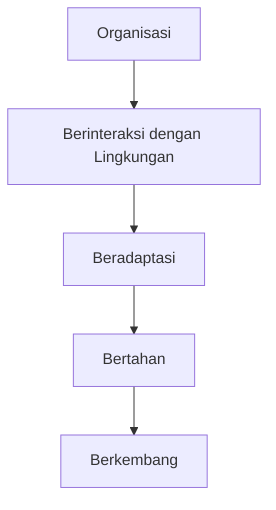
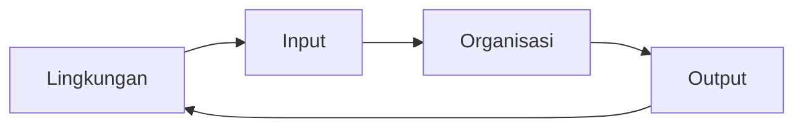

# 📘 Modul 02 — Lingkungan Organisasi

> *"Organisasi tidak hidup di ruang hampa. Ia hidup di tengah perubahan, persaingan, teknologi, hukum, dan masyarakat."*

---

# 🎯 Tujuan Pembelajaran

Setelah mempelajari modul ini, kita diharapkan mampu memahami:

* Perbedaan **Lingkungan Langsung** (Internal & Eksternal) dan **Lingkungan Tidak Langsung**.
* **Model hubungan organisasi dan lingkungan**.
* Konsep **Etika Bisnis** dan penerapannya.
* **Tanggung Jawab Sosial Perusahaan (CSR)** serta perdebatan di sekitarnya.
* Hakikat **Globalisasi** dan cara kerja **Perusahaan Multinasional (MNC)**.

---

# 🧠 Gambaran Besar Modul

## Modul ini membahas apa?

Modul ini menjelaskan bahwa:

> **Organisasi tidak pernah bekerja sendirian.**

Setiap perusahaan selalu dipengaruhi oleh:

* konsumen
* pesaing
* pemerintah
* teknologi
* ekonomi
* perubahan sosial
* globalisasi

Artinya:

> Perusahaan harus terus beradaptasi.

Jika gagal membaca lingkungan:

❌ kalah bersaing
❌ kehilangan pelanggan
❌ bangkrut

Contoh nyata:

* **Nokia** gagal beradaptasi dengan smartphone.
* **PT Pos Indonesia** tergeser digitalisasi.
* **Amazon** justru memanfaatkan internet menjadi peluang besar.

---

# 🌍 Cara Berpikir Modul

## *“Organisasi adalah Sistem Terbuka”*

Bayangkan perusahaan seperti manusia.

Manusia:

```text
Mengambil makanan
↓
Mengolah energi
↓
Menghasilkan aktivitas
```

Organisasi juga sama:

```text
Input
↓
Process
↓
Output
```

### Contohnya:

```text
INPUT
(Karyawan, modal, bahan baku)
          ↓
PROSES
(Produksi, koordinasi, manajemen)
          ↓
OUTPUT
(Produk, jasa, informasi)
```

Masalahnya:

> Lingkungan di luar selalu berubah.

Karena itu:

> Organisasi harus terus menyesuaikan diri.

Kalau tidak?

```text
Tidak adaptif
↓
Kalah bersaing
↓
Kehilangan pasar
↓
Gagal bertahan
```

---

# 📌 Konsep Inti

# 1️⃣ Lingkungan Organisasi

## 📖 Definisi

Lingkungan organisasi adalah:

> Segala elemen yang memengaruhi aktivitas perusahaan, baik dari luar maupun dari dalam organisasi.

---

## 💡 Inti Konsep

Organisasi merupakan:

> **Open System (Sistem Terbuka)**

Artinya:

Perusahaan selalu berinteraksi dengan lingkungan.

### Siklusnya:

```text
Lingkungan memberi INPUT
↓
Organisasi memproses
↓
Lingkungan menerima OUTPUT
```

---

## 🧠 Contoh Sederhana

Pemerintah membuat aturan limbah baru.

Akibatnya:

Perusahaan harus:

* mengganti teknologi produksi
* mengurangi polusi
* menyesuaikan SOP

Kalau tidak:

> ❌ Bisa ditutup.

---

## ⭐ Kenapa Ini Penting?

Karena:

> Kelangsungan hidup perusahaan bergantung pada kemampuannya membaca lingkungan.

Perusahaan yang tidak adaptif:

```text
Lambat berubah
↓
Tertinggal
↓
Bangkrut
```

---

# 2️⃣ Lingkungan Langsung (Stakeholder)

## 📖 Definisi

Stakeholder adalah:

> Pihak-pihak yang secara langsung menentukan nasib organisasi.

Mereka bisa memengaruhi:

* keuntungan
* operasional
* reputasi
* keberlangsungan perusahaan

---

## 🔥 Dibagi Menjadi 2

## A. Internal Environment

Pihak di dalam organisasi.

| Komponen           | Pengaruh             |
| ------------------ | -------------------- |
| 👨‍💼 Karyawan     | Menjalankan operasi  |
| 🏛 Dewan Komisaris | Mengawasi perusahaan |
| 💰 Pemegang Saham  | Menyediakan modal    |

---

## B. External Direct Environment

Pihak luar yang berdampak langsung.

| Stakeholder             | Dampak                |
| ----------------------- | --------------------- |
| 🛍 Konsumen             | Menentukan penjualan  |
| 🚚 Pemasok              | Menentukan bahan baku |
| ⚔️ Pesaing              | Menentukan strategi   |
| 🏛 Pemerintah           | Membuat regulasi      |
| 🏦 Lembaga Keuangan     | Sumber modal          |
| 👥 Kelompok Kepentingan | Tekanan sosial        |

---

## ⚠️ Hubungan Sebab–Akibat

Masalah stakeholder sering bertabrakan.

Contoh:

```text
Karyawan
ingin gaji tinggi

Pemegang saham
ingin laba besar
```

Manajer harus:

> Menyeimbangkan kepentingan tersebut.

Inilah alasan:

> **Etika bisnis menjadi penting.**

---

## 🧠 Contoh Nyata

Jika pemasok menaikkan harga bahan baku:

```text
Biaya produksi naik
↓
Laba turun
↓
Harga produk mungkin naik
```

Dampaknya bisa langsung terjadi hari itu juga.

---

# 3️⃣ Lingkungan Tidak Langsung

## *General Environment*

## 📖 Definisi

Lingkungan tidak langsung adalah:

> Faktor yang tidak memengaruhi perusahaan secara instan, tetapi membentuk kondisi bisnis.

---

## Variabel Utama

### 👥 Sosial

Meliputi:

* demografi
* pendidikan
* budaya
* gaya hidup

### Contoh

Gaya hidup sehat meningkat.

Akibat:

```text
Peluang:
Bisnis makanan sehat naik

Ancaman:
Fast food bisa menurun
```

---

### 💰 Ekonomi

Meliputi:

* inflasi
* suku bunga
* kurs mata uang

### Contoh

Rupiah melemah.

Akibat:

> Barang impor menjadi mahal.

---

### 🏛 Politik & Hukum

Meliputi:

* regulasi
* pajak
* aturan industri

### Contoh

Larangan plastik sekali pakai.

Akibat:

> Bisnis harus mencari bahan alternatif.

---

### 💻 Teknologi

Variabel paling cepat berubah.

### Contoh Logika

Internet tidak langsung membunuh toko buku.

Tapi:

```text
Internet
↓
Muncul Amazon
↓
Persaingan berubah
↓
Toko fisik terancam
```

---

# 4️⃣ Model Ketidakpastian Lingkungan

## *James D. Thomson*

## 📖 Definisi

Model untuk mengukur:

> Seberapa sulit lingkungan organisasi diprediksi.

---

## Dua Dimensi Penting

### 1. Tingkat Perubahan

| Jenis   | Makna          |
| ------- | -------------- |
| Stabil  | Jarang berubah |
| Dinamis | Cepat berubah  |

---

### 2. Tingkat Homogenitas

| Jenis     | Makna          |
| --------- | -------------- |
| Sederhana | Sedikit faktor |
| Kompleks  | Banyak faktor  |

---

## Hasil Kombinasi

### 🟢 Ketidakpastian Rendah

Lingkungan:

```text
Stabil + sederhana
```

Contoh:

> Industri makanan pokok.

---

### 🔴 Ketidakpastian Tinggi

Lingkungan:

```text
Dinamis + kompleks
```

Contoh:

> Industri komputer & teknologi.

---

## ⚠️ Kesalahan Umum

Mahasiswa sering mengira:

> Industri mobil sangat dinamis.

Padahal:

> Perubahannya relatif lambat,
> namun kompleks.

Karena:

* banyak supplier
* regulasi ketat
* teknologi tinggi

Maka:

> Ketidakpastian moderat.

---

# 5️⃣ Lima Kekuatan Kompetisi

## *Michael Porter*

## 📖 Definisi

Kerangka untuk menilai:

> Apakah sebuah industri menarik atau tidak.

---

## 5 Forces

### 1️⃣ Ancaman Pendatang Baru

Semakin mudah masuk:

> laba makin kecil.

Contoh:

Restoran.

Barrier to entry rendah.

---

### 2️⃣ Produk Substitusi

Produk pengganti.

Contoh:

```text
Kopi
↔ Teh
↔ Minuman energi
```

Semakin banyak substitusi:

> posisi perusahaan makin lemah.

---

### 3️⃣ Bargaining Power of Supplier

Jika pemasok kuat:

> perusahaan sulit menawar harga.

---

### 4️⃣ Bargaining Power of Buyer

Pembeli kuat jika:

* banyak pilihan
* mudah pindah merek

---

### 5️⃣ Rivalry Among Competitors

Persaingan antar pemain.

Semakin sengit:

> profit makin kecil.

---

## 🎯 Inti Porter

Jika:

```text
5 kekuatan kuat
```

Maka:

> Industri tidak menarik.

Karena:

> laba sulit besar.

---

# 6️⃣ Etika Bisnis & CSR

## 📖 Definisi

### Etika Bisnis

Studi tentang:

> Hak, kewajiban, dan moral dalam keputusan bisnis.

### CSR

Pelaksanaan etika bisnis dalam tindakan nyata.

---

## 4 Tingkatan Etika

### 1️⃣ Masyarakat

Nilai moral umum.

### 2️⃣ Stakeholder

Kewajiban terhadap pihak terkait.

### 3️⃣ Kebijakan Internal

Aturan perusahaan.

### 4️⃣ Individu

Nilai moral pribadi.

---

## Faktor Pembentuk Etika

* keluarga
* agama
* pengalaman
* lingkungan sosial
* situasi

---

## Pendekatan CSR

### ❌ Penghindaran

Menutupi masalah.

### ⚖️ Kewajiban

Hanya taat hukum.

### 🤝 Respons

Membantu jika menguntungkan.

### 🌱 Kontribusi

Aktif membantu masyarakat.

---

## ⚠️ Pro & Kontra CSR

### Pro

CSR membuat perusahaan:

* dipercaya
* berkelanjutan
* reputasi baik

### Kontra (Milton Friedman)

Menurut Friedman:

> Menggunakan uang pemegang saham untuk CSR dianggap tidak etis.

Karena tugas perusahaan:

> menghasilkan laba.

---

# 7️⃣ Globalisasi & MNC

## 📖 Definisi

### Globalisasi

Proses:

> Menyempitnya batas dunia.

### MNC

Perusahaan yang beroperasi di lebih dari satu negara.

---

## Cara Kerja MNC

Prinsip:

> Input bersifat mobile.

Contoh:

```text
Desain → Paris
Modal → Jepang
Bahan baku → Cina
Pasar → Amerika
```

---

## Perbedaan dengan David Ricardo

### Ricardo

Input dianggap:

```text
Tidak mobile
```

Negara fokus pada:

> comparative advantage.

---

### MNC Modern

Input:

```text
Bisa dipindah
```

Ke negara paling efisien.

---

# 🔄 Alur Berpikir Modul

```text
Organisasi adalah sistem terbuka
↓
Harus memahami lingkungan
↓
Identifikasi stakeholder
↓
Analisis ketidakpastian & kompetisi
↓
Gunakan etika & CSR
↓
Siap bersaing global
```

---

# ⚠️ Poin Penting

## 🔥 Wajib Hafal

* Lingkungan langsung vs tidak langsung
* 5 Forces Porter
* Pro-kontra CSR
* Pendekatan CSR
* Karakteristik MNC

---

# 📝 Cheat Sheet

```text
Stakeholder = penentu nasib perusahaan

Task Environment = lingkungan langsung eksternal

Porter = 5 kekuatan industri

CSR = tanggung jawab sosial

MNC = perusahaan lintas negara

Hot Money = modal asing cepat keluar masuk
```

---

# 🔑 Kata Kunci 

| Istilah               | Makna                     |
| --------------------- | ------------------------- |
| Direct Environment    | Lingkungan langsung       |
| Indirect Environment  | Lingkungan tidak langsung |
| Barrier to Entry      | Hambatan masuk industri   |
| Substitusi            | Produk pengganti          |
| Ethical Lapse         | Tindakan tidak etis       |
| Comparative Advantage | Keunggulan komparatif     |

---

# ❓ Pertanyaan Pemahaman Diri

1. Apa beda lingkungan internal dan eksternal?
2. Mengapa Nokia gagal beradaptasi?
3. Sebutkan stakeholder eksternal!
4. Apa itu ESOP?
5. Jelaskan model Thomson!
6. Sebutkan 5 Forces Porter!
7. Mengapa CSR diperdebatkan?
8. Apa itu MNC?
9. Mengapa globalisasi penting?
10. Apa risiko hot money?

---

# 🎯 Last Minute Review (1 Menit Sebelum UAS)

> **Lingkungan langsung = stakeholder**
> **Lingkungan tidak langsung = sosial, ekonomi, politik, teknologi**
> **Porter = 5 kekuatan industri**
> **CSR = tanggung jawab sosial perusahaan**
> **MNC = global + input mobile**

---

# 🌍 Cara Berpikir Modul 02  
# *Lingkungan Organisasi — “Bagaimana Organisasi Bisa Bertahan Hidup?”*

> **Bayangkan organisasi seperti manusia.**  
> Manusia tidak bisa hidup sendirian di ruang hampa. Kita butuh **oksigen, makanan, teman, dan kemampuan beradaptasi**.  
> Organisasi juga begitu.

Perusahaan, kampus, koperasi, startup, bahkan UKM:

> **Tidak akan bertahan jika tidak mampu “bernafas” dan “berteman” dengan lingkungannya.**

Modul ini ingin mengajari kita:

> **Bagaimana organisasi hidup, bertahan, dan menang di tengah perubahan dunia.**

---

# 🧠 Big Picture Modul

Organisasi tidak pernah berdiri sendiri.

Ia selalu dipengaruhi oleh:

- 👥 masyarakat
- 🏛 pemerintah
- 💻 teknologi
- 💰 ekonomi
- ⚔️ pesaing
- 🛒 konsumen
- 🌍 globalisasi

Karena itu:



Kalau gagal beradaptasi?

```text
Lingkungan berubah
↓
Organisasi tidak berubah
↓
Tertinggal
↓
Bangkrut
```

Contoh nyata:

| Gagal Beradaptasi | Berhasil Beradaptasi |
|---|---|
| 📱 Nokia | 📦 Amazon |
| 📮 PT Pos Indonesia | 🎬 Netflix |

---

# 1️⃣ Logika Dasar  
# Organisasi adalah **“Sistem Terbuka”**

## ❓Mengapa teori ini muncul?

Dulu banyak orang berpikir:

> **“Mengelola perusahaan itu cuma soal urusan internal.”**

Fokusnya hanya:

- mengatur karyawan
- meningkatkan produksi
- memperbaiki mesin

Tapi kenyataannya?

Banyak perusahaan besar runtuh **bukan karena masalah internal**, melainkan karena:

> **“Disapu perubahan dari luar.”**

---

## 🍜 Analogi Warung Makan

Bayangkan:

Kamu punya warung makan.

Internalnya hebat:

✅ koki jago  
✅ pelayanan bagus  
✅ dapur rapi

Tapi tiba-tiba:

```text
Harga cabe naik 500%
ORANG DIET KARBO
tren berubah
```

Kalau kamu tetap keras kepala:

```text
“Pokoknya menu saya tetap sama!”
```

Hasilnya:

> ❌ pelanggan pergi  
> ❌ penjualan turun  
> ❌ warung tutup

---

## 💡 Cara Berpikir Modul

Organisasi itu seperti **spons**.

Ia:

### Menyerap Input

Dari lingkungan luar:

- 👨‍💼 karyawan
- 💰 modal
- 🧱 bahan baku
- 🧠 informasi

↓

### Diproses

Melalui:

- produksi
- koordinasi
- manajemen

↓

### Menghasilkan Output

Kembali ke masyarakat:

- produk
- jasa
- informasi

---

## 🔄 Hubungan Timbal Balik



Artinya:

> Organisasi dan lingkungan **saling bergantung**.

---

## ⚠️ Kesalahan Umum Mahasiswa

Banyak yang berpikir:

> “Kalau internal perusahaan bagus, pasti aman.”

**Belum tentu.**

Karena:

> Lingkungan luar bisa berubah lebih cepat daripada kemampuan organisasi beradaptasi.

---

# 2️⃣ Lingkungan Langsung vs Tidak Langsung  
# *“Siapa yang Menentukan Nasib Organisasi?”*

Modul membagi lingkungan menjadi **2 lapisan**.

Tujuannya:

> Agar manajer tahu mana yang harus diprioritaskan.

---

# 🟥 A. Lingkungan Langsung (*Direct Environment*)

Disebut juga:

> **Stakeholder**

Yaitu pihak yang kalau mereka bermasalah:

> **Bisnis bisa terguncang hari itu juga.**

---

## 🎯 Siapa Saja Stakeholder?

| Stakeholder | Pengaruh |
|---|---|
| 🛒 Konsumen | menentukan penjualan |
| 🚚 Pemasok | menentukan bahan baku |
| ⚔️ Pesaing | memengaruhi strategi |
| 🏛 Pemerintah | membuat regulasi |
| 🏦 Investor/Bank | sumber modal |
| 👨‍💼 Karyawan | menjalankan operasional |

---

## 🔥 Logika Sebab–Akibat

### Contoh 1 — Konsumen Kuat

Jika:

```text
Banyak pilihan produk
```

Maka:

```text
Konsumen punya posisi tawar tinggi
↓
Perusahaan harus:
- turunkan harga
- tingkatkan kualitas
- beri promo
```

Kalau tidak?

> ❌ ditinggalkan pelanggan

---

### Contoh 2 — Pemasok Bermasalah

Jika:

```text
Pemasok berhenti kirim bahan
```

Akibatnya:

```text
Produksi berhenti
↓
Penjualan turun
↓
Laba turun
```

Makanya:

> Stakeholder disebut **penentu nasib perusahaan**.

---

# 🟦 B. Lingkungan Tidak Langsung  
## *General Environment*

Ini adalah:

> **“Cuaca besar dunia bisnis.”**

Kamu tidak bisa mengendalikannya.

Tapi:

> Kamu harus siap menghadapinya.

---

## Variabel Utama

### 👥 Sosial

Perubahan:

- gaya hidup
- demografi
- budaya
- pendidikan

### Contoh

```text
Masyarakat makin sadar kesehatan
```

Akibat:

✅ bisnis makanan sehat naik  
❌ fast food terancam

---

### 💰 Ekonomi

Meliputi:

- inflasi
- kurs
- suku bunga

### Contoh

```text
Rupiah melemah
```

Akibat:

> barang impor mahal

---

### 🏛 Politik & Hukum

Contoh:

```text
Pemerintah melarang plastik
```

Akibat:

> perusahaan harus inovasi kemasan.

---

### 💻 Teknologi

Ini faktor:

> **Paling cepat berubah.**

---

## 📮 Analogi PT Pos Indonesia

Internet:

❌ tidak langsung membunuh PT Pos

Tapi:

```text
Internet muncul
↓
Cara komunikasi berubah
↓
Orang berhenti kirim surat
↓
Layanan pos tradisional turun
```

Artinya:

> Lingkungan tidak langsung bisa menciptakan ancaman baru.

---

# 3️⃣ Logika Ketidakpastian  
# *Model James D. Thomson*

## ❓Mengapa teori ini penting?

Karena manajer sering bingung:

> **“Seberapa waspada saya harus berjaga?”**

Thomson membuat:

> **alat ukur tingkat ketidakpastian lingkungan.**

---

## Ada 2 Sumbu Besar

### 1️⃣ Tingkat Perubahan

| Jenis | Makna |
|---|---|
| Stabil | lambat berubah |
| Dinamis | cepat berubah |

---

### 2️⃣ Tingkat Homogenitas

| Jenis | Makna |
|---|---|
| Sederhana | faktor sedikit |
| Kompleks | faktor banyak |

---

## 📌 Cara Membaca Lingkungan

### 🟢 Ketidakpastian Rendah

```text
Stabil + sederhana
```

Contoh:

🍚 bisnis makanan pokok

Karena:

> orang akan tetap makan.

---

### 🔴 Ketidakpastian Tinggi

```text
Dinamis + kompleks
```

Contoh:

💻 industri komputer

Karena:

- teknologi berubah cepat
- banyak kompetitor
- tren berubah bulanan

---

## 🎯 Shortcut Jawaban UAS

Jika soal menyebut:

```text
Perubahan sangat cepat
Banyak faktor berubah
```

Jawaban:

> **Ketidakpastian Lingkungan Tinggi**

---

# 4️⃣ Michael Porter — 5 Forces  
# *“Bisnis = Rebutan Keuntungan”*

## 💡 Logika Besarnya

Porter ingin bilang:

> **Bisnis bukan cuma perang melawan pesaing.**

Tapi:

> **Perang memperebutkan keuntungan dengan 5 kekuatan sekaligus.**

---

## 1️⃣ Ancaman Pendatang Baru

Pertanyaan:

> Seberapa mudah orang masuk industri ini?

---

### Contoh

#### Warung kopi

```text
Mudah dibuka
```

➡ ancaman tinggi

---

#### Pabrik pesawat

```text
Butuh modal triliunan
```

➡ ancaman rendah

Disebut:

> **Barrier to Entry**

---

## 2️⃣ Produk Substitusi

Ini bukan:

> merk lain.

Tapi:

> **barang berbeda yang punya fungsi sama.**

---

### Contoh

```text
Coca-Cola
```

Substitusinya:

- air putih
- teh
- kopi
- jus

Bukan hanya Pepsi.

---

## 3️⃣ Kekuatan Pemasok

Jika:

```text
Pemasok sedikit
```

Mereka jadi kuat.

Akibat:

> bisa menaikkan harga seenaknya.

---

## 4️⃣ Kekuatan Pembeli

Jika:

```text
Pilihan produk banyak
```

Pembeli jadi kuat.

Akibat:

> perusahaan harus berjuang mempertahankan pelanggan.

---

## 5️⃣ Persaingan Antar Kompetitor

Pertanyaan:

> Seberapa brutal perang harga di pasar?

Contoh:

```text
E-commerce
```

Diskon besar-besaran.

Akibat:

> margin keuntungan kecil.

---

## 🎯 Inti Porter

Jika:

```text
5 kekuatan sama-sama kuat
```

Maka:

> Industri tidak menarik.

Karena:

> sulit mendapatkan laba besar.

---

# 5️⃣ Etika Bisnis & CSR  
# *“Mengapa Perusahaan Harus Jadi Orang Baik?”*

## ❓Mengapa teori ini muncul?

Karena dulu:

> Banyak perusahaan serakah.

Contoh:

❌ merusak lingkungan  
❌ menipu konsumen  
❌ eksploitasi pekerja

demi:

```text
Untung besar
```

---

## 🌱 Cara Berpikir Etika

Logikanya sederhana:

> Kalau kamu merusak lingkungan tempatmu hidup...

Maka:

```text
Cepat atau lambat
kamu juga ikut hancur
```

---

## CSR (*Corporate Social Responsibility*)

Artinya:

> Perusahaan punya tanggung jawab terhadap masyarakat.

---

## ⚖️ Debat Besar CSR

### ❌ Milton Friedman (Kontra)

Pendapat:

> “Tugas perusahaan hanya mencari laba.”

Karena:

> uang perusahaan milik pemegang saham.

---

### ✅ Pendukung CSR (Pro)

Pendapat:

> Kalau masyarakat sehat & lingkungan baik, bisnis juga akan bertahan lebih lama.

Keuntungannya:

- reputasi naik
- konsumen percaya
- bisnis berkelanjutan

Disebut:

> **Sustainable Business**

---

# 6️⃣ Globalisasi & MNC  
# *“Dunia Tanpa Sekat”*

## ❓Mengapa teori ini muncul?

Dulu ada teori:

### David Ricardo

Katanya:

> Negara harus fokus pada keunggulan sumber dayanya.

Disebut:

> **Comparative Advantage**

Contoh:

```text
Indonesia → karet
Amerika → teknologi
```

Karena input dianggap:

```text
Tidak mobile
```

---

## 🌍 Cara Berpikir MNC

Sekarang dunia berubah.

Input:

> **Mobile (bisa berpindah negara)**

---

### Contoh Nyata

Satu kaos bisa dibuat dari:

```text
Desain → Paris
Kapas → Cina
Jahit → Indonesia
Modal → Jepang
Pasar → Jerman
```

---

## 🎯 Intinya

Manajer global berpikir:

> **“Di mana tempat paling efisien menaruh sumber daya?”**

Bukan:

> “Ini negara saya.”

---

# 🌟 Pesan Inti Modul

> **Manajemen bukan ilmu pasti seperti Matematika.**

Manajemen adalah:

> **Seni mengelola hubungan dengan lingkungan.**

Karena:

```text
Lingkungan selalu berubah
Tidak bisa diprediksi
Tidak bisa dikontrol sepenuhnya
```

Tugas manajer:

> **Tetap relevan, adaptif, dan bermanfaat bagi masyarakat.**

---

# 🎓 Last Minute Review (1 Menit Sebelum UAS)

```text
Organisasi = Sistem terbuka

Stakeholder = pihak penentu nasib

Direct Environment = pengaruh langsung

Indirect Environment = sosial, ekonomi,
politik, teknologi

Thomson =
stabil/dinamis + sederhana/kompleks

Porter =
5 kekuatan industri

CSR =
tanggung jawab sosial perusahaan

MNC =
perusahaan lintas negara
dengan input mobile
```
