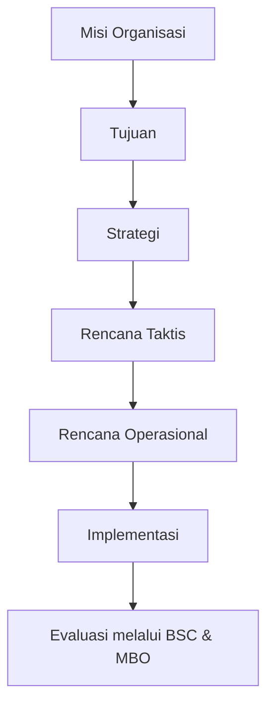
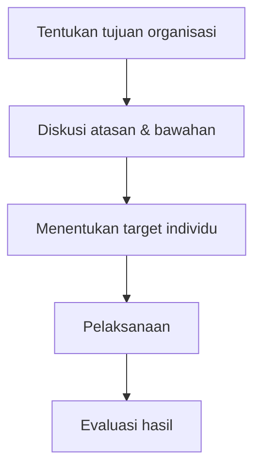
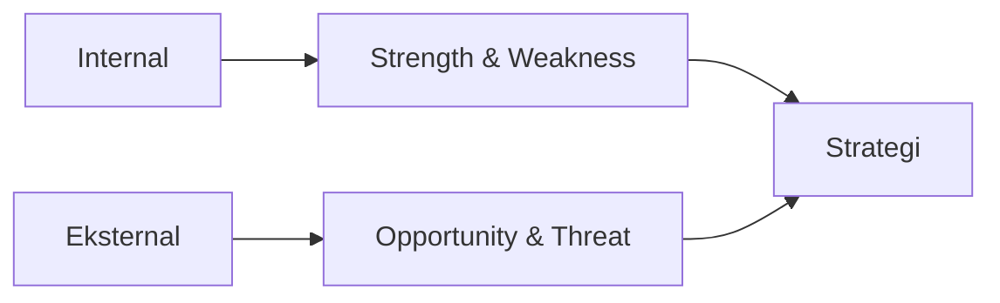

# 🎯 Modul 03 — Perencanaan & Perencanaan Strategis

### *Planning is deciding today what must be done tomorrow.*

> **Bayangkan organisasi seperti seseorang yang ingin pergi ke puncak gunung.**
>
> Tanpa peta, tanpa arah, dan tanpa bekal, kemungkinan besar ia akan tersesat.
>
> Begitu juga organisasi.
>
> **Perencanaan adalah peta perjalanan organisasi menuju tujuan.**

---

# 🧠 Gambaran Besar Modul

## Apa yang Dibahas?

Modul ini membahas:

> **Bagaimana organisasi menentukan arah masa depan dan cara mencapainya.**

Fokus utamanya adalah:

* bagaimana organisasi membuat rencana
* bagaimana strategi dibentuk
* bagaimana tujuan diturunkan menjadi tindakan nyata
* bagaimana memastikan strategi benar-benar berjalan

---

## Kenapa Materi Ini Penting?

Tanpa perencanaan:

```text
Tidak ada arah
↓
Tidak ada prioritas
↓
Karyawan bekerja sendiri-sendiri
↓
Sumber daya terbuang
↓
Organisasi gagal
```

Karena itu:

> **Planning adalah fondasi semua fungsi manajemen.**

Fungsi lain seperti:

* Organizing
* Staffing
* Leading
* Controlling

semuanya bergantung pada:

> **Apa yang direncanakan sejak awal.**

---

# 🗺️ Cara Berpikir Modul



Intinya:

> **Semua dimulai dari Misi → lalu diterjemahkan menjadi tindakan nyata.**

---

# 1️⃣ Perencanaan (*Planning*)

## Definisi

Perencanaan adalah:

> **Fungsi pertama manajemen yang menentukan tujuan dan cara mencapainya.**

Planning mencakup:

* visi
* misi
* tujuan
* strategi
* kebijakan
* program
* anggaran

---

## 💡 Logika Dasarnya

Perencanaan adalah:

> **usaha melihat masa depan sebelum masa depan datang.**

Manajer bertanya:

```text
Apa yang mungkin terjadi?
Apa risikonya?
Apa peluangnya?
Apa yang harus dilakukan mulai sekarang?
```

---

## 🍜 Analogi Restoran

Bayangkan kamu punya restoran.

Kalau tidak ada rencana:

```text
Menu berubah-ubah
Bahan habis
Karyawan bingung
Target tidak jelas
```

Tapi jika ada planning:

✅ target pelanggan jelas
✅ tren makanan diprediksi
✅ stok terkontrol
✅ promosi terarah

---

## Mengapa Perencanaan Penting?

### 1. Mengurangi ketidakpastian

Karena masa depan penuh risiko.

### 2. Membantu koordinasi

Semua departemen bergerak ke arah yang sama.

### 3. Dasar pengendalian

Kalau tidak ada target:

> **Apa yang mau dievaluasi?**

---

## ⚠️ Kontroversi Perencanaan

### ✅ Sisi Positif

Perencanaan:

* meningkatkan fokus
* mengurangi pemborosan
* membantu koordinasi
* memperjelas tujuan

### ❌ Sisi Negatif

Perencanaan bisa:

* mahal
* makan waktu
* membuat organisasi terlalu kaku

Karena:

> Dunia berubah cepat.

Rencana terlalu rigid bisa menjadi jebakan.

---

## ✨ Konsep Penting

### *Agile Planning*

Perencanaan modern harus:

> **fleksibel dan mudah beradaptasi.**

Bukan:

```text
“Pokoknya harus sesuai rencana awal!”
```

---

# 2️⃣ Hierarki Perencanaan

## *Strategis → Taktis → Operasional*

Perencanaan punya tingkatan.

Karena:

> CEO dan supervisor tidak memikirkan hal yang sama.

---

## 🟥 A. Strategis

### Fokus:

> Masa depan besar organisasi.

### Karakteristik

| Aspek   | Strategis              |
| ------- | ---------------------- |
| Waktu   | > 5 tahun              |
| Pembuat | Manajemen Puncak       |
| Fokus   | Organisasi keseluruhan |
| Sifat   | Jangka panjang         |

### Contoh

```text
Menjadi market leader Asia Tenggara
```

---

## 🟨 B. Taktis

### Fokus:

> Mewujudkan strategi besar.

| Aspek   | Taktis                  |
| ------- | ----------------------- |
| Waktu   | 1–5 tahun               |
| Pembuat | Top & Middle Management |
| Fokus   | Divisi/departemen       |

### Contoh

```text
Membangun pabrik baru di Asia
```

---

## 🟩 C. Operasional

### Fokus:

> Aktivitas harian.

| Aspek   | Operasional               |
| ------- | ------------------------- |
| Waktu   | < 1 tahun                 |
| Pembuat | Middle & Lower Management |
| Fokus   | Aktivitas spesifik        |

### Contoh

```text
Target produksi harian
```

---

## 🎯 Cara Mengingat

```text
Strategis = arah besar
Taktis = cara besar
Operasional = tindakan nyata
```

---

# 3️⃣ Jenis Rencana

## Single-Use Plan

Dipakai:

> **sekali saja.**

Contoh:

* proyek pembangunan gedung
* event perusahaan
* program launching

---

## Standing Plan

Dipakai:

> **berulang kali.**

Contoh:

* SOP
* aturan kerja
* prosedur operasional

---

## ⚠️ Kebijakan vs Aturan

### Kebijakan (*Policy*)

Memberi:

> **arah berpikir**

Masih ada fleksibilitas.

### Aturan (*Rule*)

Memberi:

> **perintah spesifik**

Tidak ada ruang penyimpangan.

Contoh:

**Kebijakan:**

```text
Utamakan pelayanan pelanggan.
```

**Aturan:**

```text
Semua email wajib dibalas maksimal 24 jam.
```

---

# 4️⃣ Contingency Planning

## *Rencana Cadangan*

## Definisi

Perencanaan situasional adalah:

> **rencana alternatif jika kondisi tidak berjalan sesuai harapan.**

Prinsipnya:

```text
Jika A gagal
↓
Lakukan B
```

---

## Contoh

Maskapai penerbangan:

```text
Jika cuaca buruk
↓
Alihkan penerbangan
```

Perusahaan:

```text
Jika supplier gagal
↓
Gunakan supplier cadangan
```

---

## Mengapa Penting?

Karena:

> Dunia bisnis penuh ketidakpastian.

---

# 5️⃣ Management by Objectives (MBO)

## *Peter Drucker*

## Definisi

MBO adalah:

> **penetapan tujuan secara partisipatif antara atasan dan bawahan.**

---

## 💡 Logika Dasarnya

Orang lebih termotivasi ketika:

> **ikut menentukan targetnya sendiri.**

Daripada:

```text
“Ini targetmu. Kerjakan!”
```

---

## Cara Kerja MBO



---

## Kelebihan

✅ motivasi meningkat
✅ komunikasi lebih baik
✅ rasa memiliki lebih tinggi

---

## Kesalahan Umum

MBO dianggap:

> sekadar isi formulir target.

Padahal inti sebenarnya:

> **komunikasi & partisipasi.**

---

# 6️⃣ Analisis SWOT

## Definisi

SWOT digunakan untuk menganalisis:

### Internal

* **Strengths** → kekuatan
* **Weaknesses** → kelemahan

### Eksternal

* **Opportunities** → peluang
* **Threats** → ancaman

---

## Cara Berpikir SWOT



---

## 📚 Contoh

Toko buku:

### Strength

✅ lokasi strategis

### Weakness

❌ koleksi kurang lengkap

### Opportunity

📈 tren baca meningkat

### Threat

⚔️ marketplace online

---

## ⚠️ Kesalahan Mahasiswa

Banyak yang hanya:

```text
mendaftar SWOT
```

Padahal tujuan SWOT:

> **menghasilkan keputusan strategis.**

---

# 7️⃣ Matriks BCG

## *Boston Consulting Group*

BCG membantu perusahaan:

> **mengatur portofolio bisnis.**

Dilihat dari:

* pertumbuhan pasar
* pangsa pasar relatif

---

## ⭐ Star

```text
Pertumbuhan tinggi
Pangsa besar
```

Butuh investasi besar.

---

## 🐄 Cash Cow

```text
Pertumbuhan rendah
Pangsa besar
```

Disebut:

> mesin uang perusahaan.

---

## ❓ Question Mark

```text
Pertumbuhan tinggi
Pangsa kecil
```

Butuh keputusan:

```text
Invest atau hentikan?
```

---

## 🐶 Dog

```text
Pertumbuhan rendah
Pangsa kecil
```

Prospek buruk.

---

## 🎯 Cara Mengingat Siklus

```text
Question Mark
↓
Star
↓
Cash Cow
↓
Dog
```

---

# 8️⃣ Balanced Scorecard (BSC)

## *Kaplan & Norton*

## Definisi

BSC adalah:

> **alat evaluasi strategi secara seimbang.**

Tidak hanya:

```text
Profit
```

Tetapi juga:

```text
pelanggan
proses internal
pembelajaran
```

---

## 4 Perspektif BSC

### 💰 Keuangan

> Bagaimana pemegang saham melihat kita?

### ❤️ Pelanggan

> Bagaimana pelanggan melihat kita?

### ⚙️ Internal Business

> Apa yang harus kita kuasai?

### 📚 Learning & Innovation

> Bagaimana kita berkembang?

---

## 🎯 Intinya

BSC mencegah perusahaan:

> hanya mengejar profit jangka pendek.

---

# 9️⃣ Strategi Organisasi

Strategi terbagi menjadi:

## Korporasi

Strategi perusahaan secara keseluruhan.

## Bisnis

Cara bersaing.

### Michael Porter

1. Diferensiasi
2. Biaya Rendah
3. Fokus

## Fungsional

Strategi tiap divisi.

Contoh:

* HR
* Marketing
* Produksi

---

# 🔟 Model 7-S McKinsey

## Definisi

Model untuk memastikan:

> seluruh elemen organisasi selaras.

---

## 7 Komponen

1. Strategy
2. Structure
3. Systems
4. Staff
5. Skills
6. Style
7. Superordinate Goals

---

## 🎯 Ide Besarnya

Kalau satu unsur tidak sinkron:

> strategi bisa gagal.

Contoh:

Strategi digital bagus,

Tapi:

```text
skill karyawan rendah
```

➡ implementasi gagal.

---

# 🔄 Alur Berpikir Modul

```text
Analisis SWOT
↓
Tentukan Misi
↓
Buat Tujuan Strategis
↓
Pilih Strategi
↓
Turunkan ke Taktis
↓
Turunkan ke Operasional
↓
Implementasi
↓
Evaluasi (MBO & BSC)
```

---

# ⚠️ Poin yang Sering Keluar di UAS

### Wajib Hafal

* Strategis vs Taktis vs Operasional
* Single-use vs Standing plan
* Policy vs Rule
* 4 kategori BCG
* 4 perspektif BSC
* 5 Forces Porter
* 7-S McKinsey
* MBO = partisipatif
* Structure follows strategy

---

# 📝 Cheat Sheet 1 Menit Sebelum UAS

```text
Planning = fungsi pertama

Strategis = >5 tahun
Taktis = 1–5 tahun
Operasional = <1 tahun

MBO = target bersama

SWOT =
S/W internal
O/T eksternal

BCG =
Question Mark
Star
Cash Cow
Dog

BSC =
Keuangan
Pelanggan
Internal
Pembelajaran

7S =
Strategy
Structure
Systems
Staff
Skills
Style
Shared Goals
```

---

# 🌟 Pesan Inti Modul

> **Organisasi yang gagal merencanakan, sedang merencanakan kegagalan.**

Namun:

> **Rencana yang baik bukan yang paling kaku, melainkan yang paling adaptif terhadap perubahan.**

Karena:

> **Manajemen bukan tentang meramal masa depan, tapi menyiapkan organisasi menghadapi masa depan.** 🚀

---

# 🧭 Cara Berpikir Modul 03  
# *Perencanaan & Perencanaan Strategis*  
### *“Managing uncertainty before uncertainty manages you.”*

> **Manajemen bukan sekadar menghafal definisi.**  
> Manajemen adalah memahami bagaimana mengendalikan **kapal besar di tengah samudra yang tidak menentu**.  
>
> Ombak bisa berubah. Cuaca bisa buruk. Kompetitor bisa datang tiba-tiba.  
>
> Karena itu, organisasi membutuhkan:
>
> > **Peta, arah, cadangan, dan strategi.**
>
> Itulah fungsi utama:
>
> # 🎯 **Perencanaan (Planning)**

---

# 🧠 Filosofi Besar Modul

Bayangkan sebuah kapal besar.

Kalau kapten hanya berkata:

> *“Yaudah jalan saja, nanti lihat situasi.”*

Apa yang terjadi?

```text
Tidak ada arah
↓
Bahan bakar habis
↓
Awak bingung
↓
Kapal tersesat
↓
Misi gagal
```

Karena itu:

> **Perencanaan muncul untuk mengurangi ketidakpastian.**

Tetapi—

> Dunia tidak pernah benar-benar bisa diprediksi.

Maka:

> **Rencana harus fleksibel, bukan kaku.**

---

# 1️⃣ Mengapa Perencanaan Itu Ada?
## *The Philosophy of Planning*

## 💡 Logika Dasarnya

Bayangkan kamu mau liburan keluar kota.

Tanpa planning:

```text
Tidak tahu naik apa
Tidak booking hotel
Tidak hitung biaya
Tidak tahu tujuan wisata
```

Hasilnya?

> ❌ uang habis  
> ❌ waktu terbuang  
> ❌ stres di jalan

---

## Dalam Organisasi Juga Sama

Manajer berpikir:

```text
Apa yang mungkin terjadi?
Apa risiko terbesarnya?
Apa peluangnya?
Bagaimana cara menang?
```

Karena bisnis:

> **selalu penuh ketidakpastian.**

---

## 🎯 Fungsi Utama Planning

Planning membantu organisasi:

### 1. Menentukan arah

Organisasi tahu:

> mau ke mana.

---

### 2. Mengurangi risiko

Karena:

> kemungkinan masalah sudah dipikirkan lebih dulu.

---

### 3. Membantu koordinasi

Semua bagian organisasi:

> bergerak ke tujuan yang sama.

---

### 4. Menjadi dasar pengendalian

Kalau tidak ada target:

> **apa yang mau dievaluasi?**

---

## ⚖️ Kontroversi Perencanaan

### ✅ Sisi Positif

Planning membuat:

- lebih fokus
- lebih terorganisir
- risiko lebih kecil
- koordinasi lebih baik

---

### ❌ Sisi Negatif

Planning juga bisa menjadi:

> **jebakan.**

Jika terlalu kaku:

```text
Lingkungan berubah
↓
Perusahaan tetap pakai rencana lama
↓
Tertinggal
```

---

## 🚀 Agile Planning

Karena dunia berubah cepat:

Muncullah konsep:

> **Agile Planning**

Artinya:

> **perencanaan yang fleksibel dan cepat beradaptasi.**

Bukan:

```text
“Pokoknya harus sesuai rencana awal!”
```

Melainkan:

```text
“Kalau situasi berubah,
strategi ikut berubah.”
```

---

# 2️⃣ Membedakan Rencana  
# *Dari Mimpi → Menjadi Aksi Nyata*

Gunakan analogi:

# 🏠 *Membangun Rumah*

Karena seluruh jenis planning sebenarnya:

> hanya cara memecah mimpi besar menjadi langkah kecil.

---

## 🌟 Misi (*Mission*)

### Pertanyaan Besar:

> **“Mengapa organisasi ini ada?”**

---

### Analogi Rumah

```text
Mengapa rumah dibangun?
```

Jawaban:

> Agar keluarga punya tempat tinggal nyaman.

---

### Dalam Organisasi

Contoh:

```text
Memberikan pendidikan berkualitas
```

atau

```text
Membantu masyarakat mendapat layanan kesehatan
```

---

## 🎯 Tujuan (*Goal*)

Pertanyaan:

> **“Apa hasil akhirnya?”**

---

### Analogi Rumah

```text
Rumah selesai
2 lantai
dalam 1 tahun
```

---

### Intinya

Tujuan harus:

✅ jelas  
✅ spesifik  
✅ terukur

---

# ⚠️ Kebijakan vs Aturan
## *Jebakan UAS Paling Sering*

Banyak mahasiswa tertukar.

Padahal:

> dua hal ini sangat berbeda.

---

## 🟨 Kebijakan (*Policy*)

Kebijakan adalah:

> **panduan berpikir.**

Masih ada ruang fleksibilitas.

---

### Contoh

```text
“Kita mengutamakan bahan lokal.”
```

Artinya:

boleh pilih supplier A atau B,

asal:

> tetap lokal.

---

## 🟥 Aturan (*Rule*)

Aturan adalah:

> **harga mati.**

Tidak bisa ditawar.

---

### Contoh

```text
Dilarang merokok
di area proyek.
```

Tidak ada negosiasi.

---

## 🎯 Shortcut Mengingat

```text
Policy = arah berpikir

Rule = tindakan spesifik
```

---

# ⚙️ Prosedur (*Procedure*)

Jika aturan menjelaskan:

> **apa yang harus dilakukan**

Maka prosedur menjelaskan:

> **urutan melakukannya.**

---

### Analogi Rumah

```text
Fondasi
↓
Dinding
↓
Atap
↓
Finishing
```

Tidak mungkin:

```text
Pasang atap dulu
baru fondasi
```

---

# 3️⃣ Perencanaan Strategis  
# *The Grand Plan*

## ❓Mengapa Konsep Ini Muncul?

Dulu perusahaan cukup berpikir:

```text
Target minggu depan
```

Tapi sekarang?

Persaingan:

> makin brutal.

Karena itu perusahaan mulai berpikir:

```text
5 tahun lagi kita mau jadi apa?
10 tahun lagi kita ada di mana?
```

Inilah:

# 🎯 **Strategic Planning**

---

## Definisi

Perencanaan strategis adalah:

> **rencana jangka panjang organisasi untuk memenangkan persaingan.**

Biasanya:

```text
> 5 tahun
```

---

## Cara Berpikir Strategis

Bukan:

```text
“Minggu depan jual berapa?”
```

Tetapi:

```text
“Bagaimana perusahaan tetap hidup
10 tahun ke depan?”
```

---

# 4️⃣ Analisis SWOT  
## *Perusahaan Sedang “Curhat”*

SWOT adalah alat:

> untuk memahami kondisi organisasi.

---

## Internal

### 💪 Strength

Apa kekuatan kita?

Contoh:

✅ brand kuat  
✅ lokasi strategis

---

### 🩹 Weakness

Apa kelemahan kita?

Contoh:

❌ modal kecil  
❌ SDM terbatas

---

## Eksternal

### 🌱 Opportunity

Peluang apa di luar?

Contoh:

📈 tren digital naik

---

### ⚠️ Threat

Apa ancamannya?

Contoh:

⚔️ pesaing baru

---

## 🎯 Inti SWOT

Bukan sekadar daftar.

Tapi:

> **alat mengambil keputusan strategis.**

---

## 📚 Contoh Logika SWOT

```text
Strength:
Brand kuat

Opportunity:
Pasar online tumbuh

Strategi:
Ekspansi digital
```

---

# 5️⃣ Matriks BCG  
## *Mengatur Banyak Bisnis Sekaligus*

Bayangkan perusahaan punya:

- banyak produk
- banyak unit bisnis

Pertanyaannya:

> Mana yang harus didanai?

---

## ⭐ Star (*Bintang*)

```text
Pertumbuhan tinggi
Pangsa besar
```

Bagus.

Tapi:

> butuh modal besar.

---

## 🐄 Cash Cow (*Sapi Perah*)

```text
Pertumbuhan rendah
Pangsa besar
```

Ini:

> mesin uang perusahaan.

Keuntungan besar dipakai:

> membiayai bisnis lain.

---

## ❓ Question Mark

```text
Pertumbuhan tinggi
Pangsa kecil
```

Masih abu-abu.

Pertanyaannya:

```text
Dipertahankan?
atau ditinggalkan?
```

---

## 🐶 Dog

```text
Pertumbuhan rendah
Pangsa kecil
```

Prospeknya lemah.

---

## 🔄 Siklus Umum

```text
Question Mark
↓
Star
↓
Cash Cow
↓
Dog
```

---

# 6️⃣ Strategi Generik Michael Porter  
# *Bagaimana Cara Menang?*

Menurut Porter:

> Organisasi harus memilih cara menang.

Tidak bisa:

> mau semuanya sekaligus.

---

## 1️⃣ Low Cost

Strategi:

> jadi yang paling murah.

Contoh:

diskon besar  
biaya rendah

---

## 2️⃣ Differentiation

Strategi:

> jadi paling unik.

Contoh:

Apple

Karena:

> desain & pengalaman berbeda.

---

## 3️⃣ Focus

Strategi:

> melayani pasar kecil yang spesifik.

Contoh:

produk vegan premium.

---

## 🎯 Intinya

Jangan:

```text
murah
unik
premium
massal
semua sekaligus
```

Karena:

> bisa kehilangan identitas bisnis.

---

# 7️⃣ Balanced Scorecard (BSC)
## *Kaplan & Norton*

## ❓Mengapa Konsep Ini Muncul?

Dulu:

Manajer dianggap hebat jika:

```text
Profit tinggi
```

Tapi ternyata:

profit tinggi bisa didapat dengan cara:

❌ memeras karyawan  
❌ mengecewakan pelanggan  
❌ menurunkan kualitas

Akhirnya:

> perusahaan runtuh.

---

## Solusinya?

### Balanced Scorecard

Melihat organisasi:

> secara seimbang.

---

## 4 Perspektif BSC

### 💰 Keuangan

> Pemegang saham puas tidak?

---

### ❤️ Pelanggan

> Pelanggan senang tidak?

---

### ⚙️ Proses Internal

> Operasional rapi tidak?

---

### 📚 Pembelajaran & Pertumbuhan

> SDM berkembang tidak?

---

## 🔄 Hubungan Sebab–Akibat BSC

```text
Karyawan berkembang
↓
Proses kerja membaik
↓
Pelanggan puas
↓
Profit meningkat
```

---

# 8️⃣ Alfred Chandler  
# *Structure Follows Strategy*

Ada kalimat sakti:

> **“Structure follows strategy.”**

Artinya:

> Struktur organisasi harus mengikuti strategi.

---

## Logikanya

Kalau dulu:

```text
jualan satu kota
```

Tim kecil cukup.

---

Tapi kalau berubah jadi:

```text
jualan internasional
```

Maka:

struktur juga harus berubah.

Misalnya:

✅ divisi negara baru  
✅ manajer regional  
✅ tim global

Kalau tidak?

> strategi gagal dijalankan.

---

# 🌟 Kesimpulan Besar Modul

Manajemen itu tentang:

> **harmoni.**

```text
Planning dibuat
↓
Tujuan disepakati (MBO)
↓
Kinerja dipantau (BSC)
↓
Strategi dijalankan
↓
Struktur disesuaikan
↓
Organisasi bergerak bersama
```

Karena pada akhirnya:

> **Strategi hebat tanpa implementasi hanyalah tulisan di kertas.**

🚀
